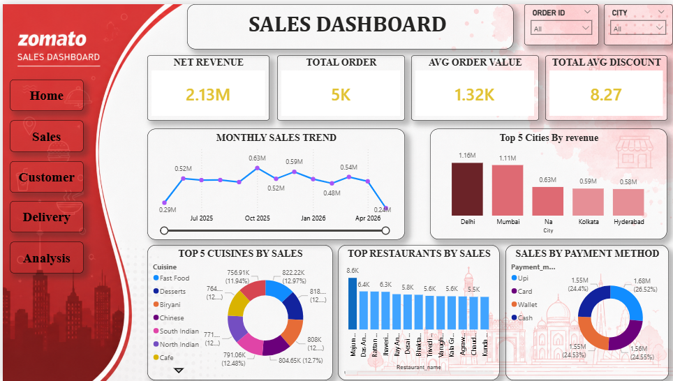
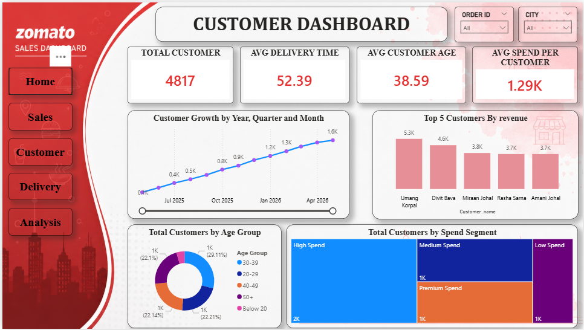
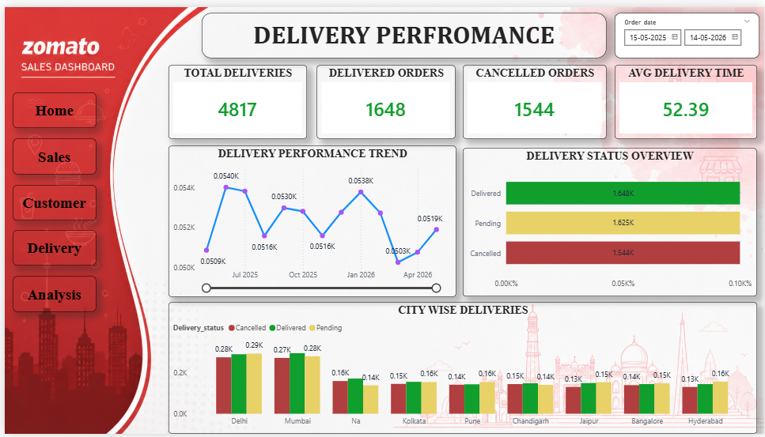
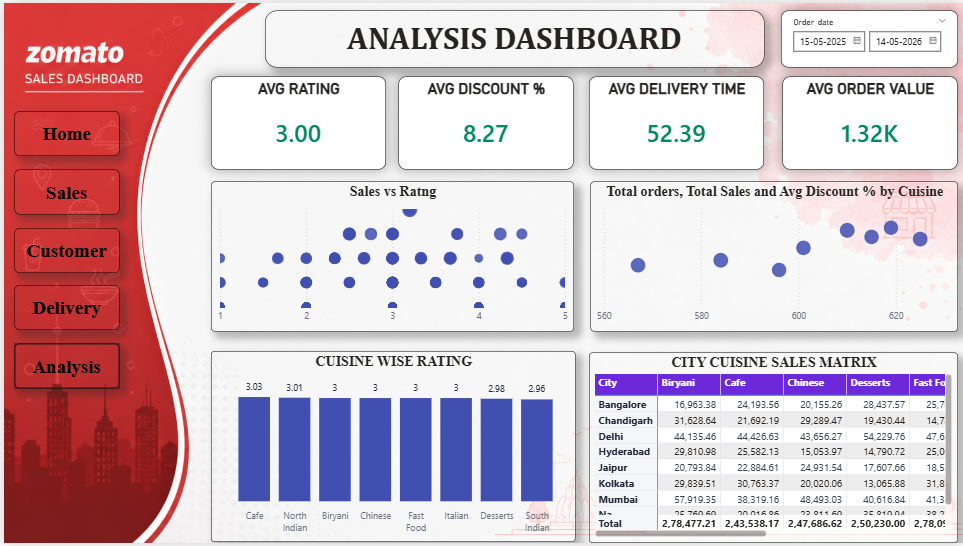

# Zomato Sales & Customer Analytics Dashboard

## 📌 Project Overview

This project presents an end-to-end Data Analytics solution built using Python, SQL Server, and Power BI. The objective was to transform raw food delivery data into meaningful business insights through data cleaning, exploratory data analysis, SQL-based business problem solving, and interactive dashboard development.

The project analyzes customer behavior, restaurant performance, delivery operations, and revenue trends to support data-driven decision-making.

**Tools Used:** Python, SQL Server, Power BI, Excel

---

# Dashboard Preview

## Home Dashboard

---

## Sales Dashboard

---

## Customer Dashboard

---

## Delivery Dashboard

---

## Business Analysis Dashboard

---

# Business Problem

Food delivery platforms generate large volumes of transactional data every day. Converting this data into actionable insights is essential for improving customer experience, operational efficiency, and business profitability.

This project addresses key business questions such as:

* Which cuisines generate the highest revenue?
* Which restaurants perform best in each city?
* What is the cancellation rate?
* How much revenue is lost due to cancelled orders?
* Which customers contribute the most revenue?
* How do sales change over time?

---

# Dataset Information

The dataset contains 4,956 food delivery orders collected across multiple cities.

## Dataset Statistics

* Total Orders: 4,956
* Cities Covered: 9
* Restaurants: 4,509
* Cuisine Types: 8
* Total Revenue: ₹65.24 Lakhs
* Average Order Value: ₹1,316
* Analysis Period: May 2025 – May 2026

## Features Included

| Category               | Attributes                        |
| ---------------------- | --------------------------------- |
| Customer Information   | Customer Name, Age                |
| Order Information      | Order ID, Order Date              |
| Restaurant Information | Restaurant Name, Cuisine          |
| Financial Metrics      | Order Amount, Discount Percentage |
| Delivery Metrics       | Delivery Time, Distance           |
| Customer Feedback      | Rating                            |
| Transaction Details    | Payment Method                    |
| Operational Status     | Delivery Status                   |

---

# Tech Stack

## Python

Used for:

* Data Cleaning
* Data Transformation
* Missing Value Handling
* Feature Engineering
* Exploratory Data Analysis

### Libraries

* Pandas
* NumPy
* Matplotlib
* Seaborn

---

## SQL Server

Used for business analytics and KPI generation.

### Concepts Applied

* Common Table Expressions (CTEs)
* Window Functions
* Dense Rank
* Aggregate Functions
* Revenue Analysis
* Customer Segmentation
* Trend Analysis

---

## Power BI

Used to develop interactive dashboards for business intelligence and decision-making.

### Features

* KPI Cards
* Dynamic Filtering
* Interactive Visualizations
* Drill-Down Analysis
* Data Storytelling

---

# Data Cleaning & Preprocessing

The raw dataset was cleaned and transformed to ensure analytical accuracy.

### Steps Performed

* Handled Missing Values
* Removed Blank Records
* Corrected Data Types
* Standardized Categorical Variables
* Validated Numerical Fields
* Created Analytical Features
* Prepared Analytics-Ready Dataset

---

# Exploratory Data Analysis

EDA was performed to uncover patterns, trends, and relationships within the dataset.

### Analysis Conducted

* Revenue Distribution Analysis
* Order Value Analysis
* Delivery Time Analysis
* Customer Rating Analysis
* Cuisine Popularity Analysis
* Customer Demographic Analysis
* Payment Method Analysis
* Distance vs Delivery Time Relationship

---

# SQL Business Analysis

The following business questions were solved using SQL queries:

### Revenue-Generating Cuisine Analysis

Identified cuisine categories contributing the highest revenue.

### Highest Rated Cuisine Analysis

Determined customer-preferred cuisine categories based on ratings.

### Cancellation Impact Analysis

Calculated revenue loss caused by cancelled orders.

### Cancellation Rate Analysis

Measured operational efficiency through cancellation metrics.

### Top Restaurant Analysis

Ranked restaurants city-wise using SQL Window Functions.

### Monthly Revenue Trend Analysis

Analyzed month-over-month business performance.

### High-Value Customer Analysis

Identified customers spending above the average order value.

### Customer Segmentation

Segmented customers using:

* Recency
* Frequency
* Monetary Value

to identify loyal and high-value customers.

---

# Key Learnings

Through this project, I gained practical experience in:

* Data Cleaning & Transformation
* Exploratory Data Analysis
* SQL Query Writing
* Window Functions & CTEs
* Business KPI Development
* Dashboard Design
* Data Visualization
* Data Storytelling
* End-to-End Analytics Workflow

---

# Author

**Aryan Prajapati**

Electrical Engineering Undergraduate | Aspiring Data Analyst

### Skills

* SQL
* Power BI
* Python
* Excel
* Data Visualization
* Business Analytics
